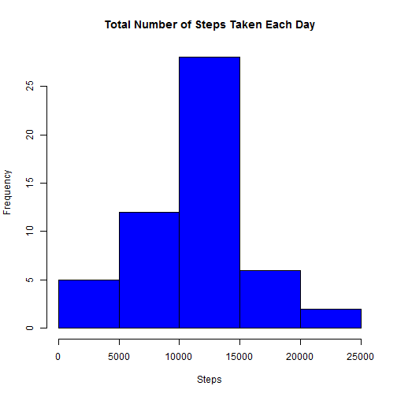
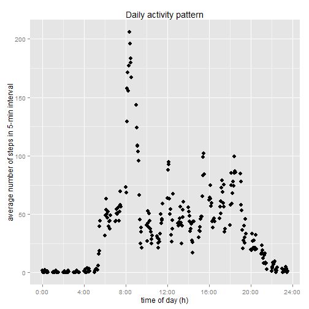
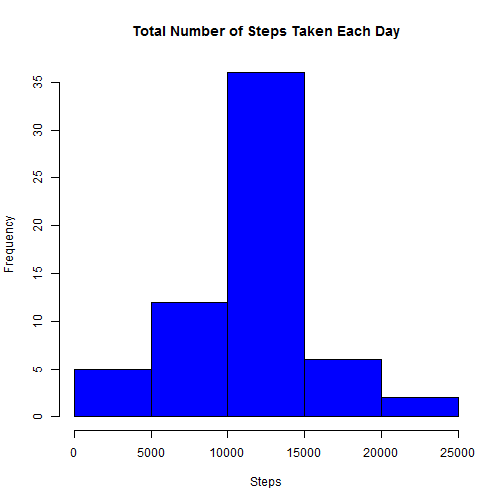
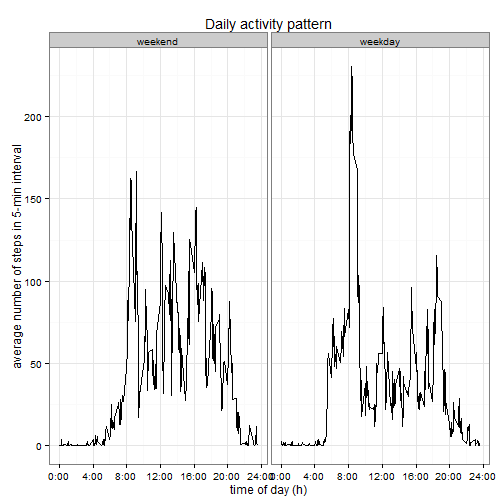

#Reproducible Research: Peer Assessment 1
The activity data was collected by an anonymous individual wearing a personal activity monitoring device for two months (from 2012-10-01 to 2012-11-30) and the number of steps was recorded in 5-minutes intervals.

Set all code chunks are visible:

##Loading and preprocessing the data

The data file activity.csv is extracted from the compressed file activity.zip and then loaded into the data frame data.The structure of the data frame and a summary statistic are displayed.


```r
unzip("Factivity.zip", exdir = "data")
```

```
## Warning in unzip("Factivity.zip", exdir = "data"): error 1 in extracting
## from zip file
```

```r
df <- read.csv("data/activity.csv", header=TRUE,sep=",")
```

```
## Warning in file(file, "rt"): cannot open file 'data/activity.csv': No such
## file or directory
```

```
## Error in file(file, "rt"): cannot open the connection
```

```r
library(dplyr)
str(df)
```

```
## 'data.frame':	17568 obs. of  3 variables:
##  $ steps   : int  NA NA NA NA NA NA NA NA NA NA ...
##  $ date    : Factor w/ 61 levels "2012-10-01","2012-10-02",..: 1 1 1 1 1 1 1 1 1 1 ...
##  $ interval: int  0 5 10 15 20 25 30 35 40 45 ...
```

```r
summary(df)
```

```
##      steps                date          interval     
##  Min.   :  0.00   2012-10-01:  288   Min.   :   0.0  
##  1st Qu.:  0.00   2012-10-02:  288   1st Qu.: 588.8  
##  Median :  0.00   2012-10-03:  288   Median :1177.5  
##  Mean   : 37.38   2012-10-04:  288   Mean   :1177.5  
##  3rd Qu.: 12.00   2012-10-05:  288   3rd Qu.:1766.2  
##  Max.   :806.00   2012-10-06:  288   Max.   :2355.0  
##  NA's   :2304     (Other)   :15840
```
##What is mean total number of steps taken per day?
The total steps per day are summed up using the dplyr functions, and the mean and median are determined

```r
grouped <- group_by(df, date)
sum_steps <- summarise(grouped, sum=sum(steps))

library(ggplot2)
hist(sum_steps$sum, col = "blue",
     main = "Total Number of Steps Taken Each Day",
     xlab = "Steps")
```

 

```r
mean_median_steps <- summarise(sum_steps
                        , mean_steps = mean(sum_steps$sum, na.rm=TRUE)
                        , median_steps = median(sum_steps$sum, na.rm=TRUE))
mean_median_steps
```

```
## Source: local data frame [1 x 2]
## 
##   mean_steps median_steps
## 1   10766.19        10765
```
##What is the average daily activity pattern?

To generate an average daily activity pattern the mean of each 5-minutes
interval over all days is determined using the dplyr functions. The activity pattern is plotted as a time series.

```r
interval_grouped <- group_by(df, interval)
sum_steps_by_intervals <- summarise(interval_grouped, mean=mean(steps, na.rm = TRUE))

ggplot(sum_steps_by_intervals)+
  geom_point(aes(x=interval/100, y=mean),size=3) +
  labs(y="average number of steps in 5-min interval") +
  labs(x="time of day (h)") +
  labs(title="Daily activity pattern")+
  scale_x_continuous(breaks=0:6*4, labels=paste(0:6*4,":00", sep=""))
```

 

```r
max_num_of_steps <- filter(sum_steps_by_intervals, mean==max(mean))
max_num_of_steps
```

```
## Source: local data frame [1 x 2]
## 
##   interval     mean
## 1      835 206.1698
```
The maximum number of steps occurs in 5-minutes interval of the day starting at 8:35.

##Imputing missing values

There are many missing values in the data set (see the data summary statistic at the top of this document):

```r
summarise (df, count(filter(df, is.na(steps))))
```

```
##      n
## 1 2304
```
The daily activity pattern can be used to impute these missing values. For every missing value in the orignial data set the average number of steps in that 5-minutes interval is used and a new data frame filled is created. This procedure should be valid if the person has daily routine, i.e. an activity pattern that is similar over multiple days. Instead of missing values this data set now contains a typical value of that 5-minutes interval.

```r
df_filled <- df %>%  
  group_by(interval) %>%
  mutate(steps = ifelse(is.na(steps), round(mean(steps, na.rm=TRUE)), steps))

summary(df_filled)
```

```
##      steps                date          interval     
##  Min.   :  0.00   2012-10-01:  288   Min.   :   0.0  
##  1st Qu.:  0.00   2012-10-02:  288   1st Qu.: 588.8  
##  Median :  0.00   2012-10-03:  288   Median :1177.5  
##  Mean   : 37.38   2012-10-04:  288   Mean   :1177.5  
##  3rd Qu.: 27.00   2012-10-05:  288   3rd Qu.:1766.2  
##  Max.   :806.00   2012-10-06:  288   Max.   :2355.0  
##                   (Other)   :15840
```
Now, using the data set with filled values, the total steps per day are again summed up and the mean and median are determined.

```r
sum_steps_filled <- summarise(group_by(df_filled, date), sum=sum(steps))
mean_median_steps_filled <- 
  sum_steps_filled %>% 
  summarise(mean_steps = mean(sum, na.rm=TRUE),
            median_steps = median(sum, na.rm=TRUE))
mean_median_steps_filled
```

```
## Source: local data frame [1 x 2]
## 
##   mean_steps median_steps
## 1   10765.64        10762
```
The total steps per day are displayed as a histogram. 

```r
hist(sum_steps_filled$sum, col = "blue",
     main = "Total Number of Steps Taken Each Day",
     xlab = "Steps")
```

 
Due to imputation the total sum of steps in these two month increases from 570608 to 656704.

```r
sum(df$steps, na.rm=TRUE)
```

```
## [1] 570608
```

```r
sum(df_filled$steps)
```

```
## [1] 656704
```
##Are there differences in activity patterns between weekdays and weekends?

In order to identify differences between weekdays and weekends a daily acitity pattern is generated for both types of days. First the data is classified as recorded either on a weekday or on a weekend, and this information is stored in week. Then the data is aggregated by 5-minutes interval and weekday/-end. Using the ggplot function a panel plot contrasting the weekday and weekend activity is produced.

```r
library(timeDate)
```

```r
df_filled$date <- as.Date(df_filled$date)

df_filled$wDay <-  factor(isWeekday(df_filled$date, wday=1:5)+1L,
                    levels=1:2, labels=c('weekend', 'weekday'))

w_plot_data <- df_filled %>%
  group_by(interval, wDay) %>%
  summarise(m_steps = mean(steps)) 

g <- ggplot(w_plot_data, aes(interval/100, m_steps))
g + geom_line()+
  facet_grid(. ~wDay) +
  theme_bw() +
  labs(y="average number of steps in 5-min interval") +
  labs(x="time of day (h)") +
  labs(title="Daily activity pattern")+
  scale_x_continuous(breaks=0:6*4, labels=paste(0:6*4,":00", sep=""))
```

 

Whereas peak and morning activity is highest during weekdays, the overall activity is higher on weekends. In light of the differences between weekdays and weekends it might be a better imputation strategy to use weekend interval averages for imputing weekend activity and weekday interval averages for imputing weekday activity.
